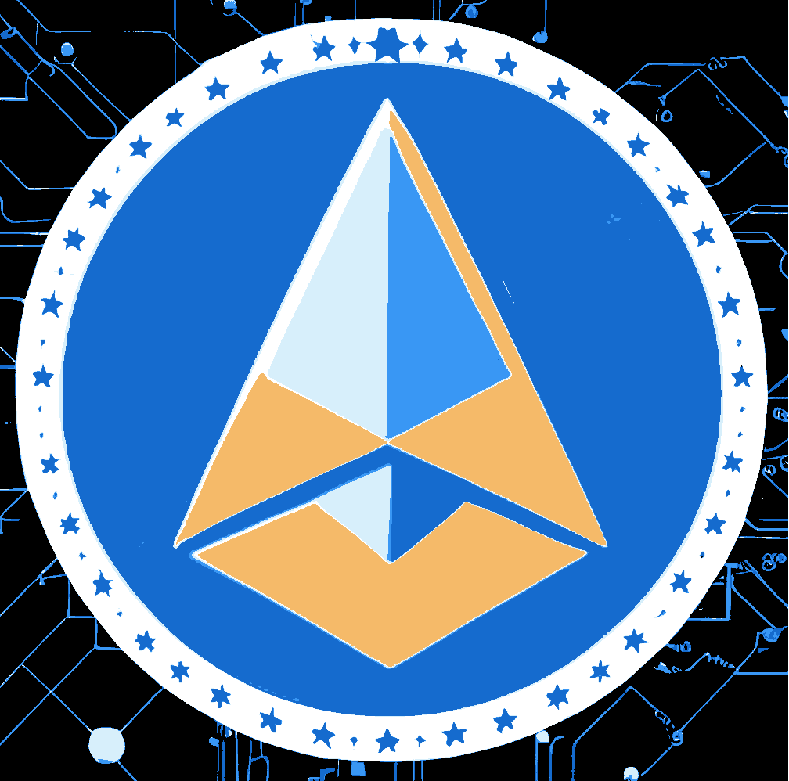

# Democracia DAO Contracts 🕊️

## Crypto por la Transparencia Electoral

> :warning: **¡Importante!** Los desarrolladores no son responsables del uso que se le dé a este código.

> :warning: **¡Important!** Developers are not responsible for the use given to this software.

## Descripción

Bienvenido al repositorio del **Smart Contract**, el contrato inteligente, creado específicamente para recibir donaciones en Ethereum. Este proyecto es open source y está bajo la licencia GPL 3.0.

## Funcionalidades principales

- Recibir donaciones directamente en Ethereum o a través de depósitos de mpEth.
- Registro de donación on-chain mediante el token ERC20, DDAO.

## Fechas importantes

- **Cierre de Donaciones**: Las donaciones serán aceptadas hasta el Domingo, 31 de Diciembre de 2023, 00:00:00 AM (Hora de Argentina).
- **Extracción de fondos por Multisig**: Desde el cierre de las donaciones y hasta el Lunes, 1 de Abril de 2024, 00:00:00 AM (Hora de Argentina), la Safe Wallet Multisig tendrá la capacidad de extraer los fondos donados. Estos se destinarán a beneficios para los fiscales registrados previamente en la aplicación de Democracia DAO.
- **Devolución de fondos**: A partir de la fecha límite de extracción por Multisig, cualquier fondo sobrante será devuelto proporcionalmente a todos los donantes.

## Notas adicionales

- La titularidad del contrato es una Safe Wallet Multisig con requerimiento de N-M cuentas para firmar transacciones.
- Recomendamos encarecidamente leer y entender el contrato antes de interactuar con él. Aunque se han tomado medidas para garantizar su seguridad, es importante que los usuarios tomen sus propias precauciones.

## Tecnologías Utilizadas

En el desarrollo de este contrato inteligente, hemos utilizado las siguientes tecnologías:

- **Hardhat**: Es un entorno de desarrollo de Ethereum que facilita la tarea de compilar, desplegar, probar y depurar contratos inteligentes. Gracias a Hardhat, hemos podido contar con una experiencia de desarrollo más fluida y un proceso de prueba más eficiente.

- **Solidity**: Es el lenguaje de programación utilizado para escribir contratos inteligentes en Ethereum. La versión 0.8.18 nos ha proporcionado características mejoradas y optimizaciones que garantizan que nuestro contrato sea seguro y eficiente.

- **Vault ERC4626 de Open Zeppelin**: Open Zeppelin es conocido por ofrecer contratos inteligentes seguros y auditados para la comunidad Ethereum. Hemos utilizado el contrato Vault `ERC4626` como base para nuestro contrato, lo que nos ha permitido asegurar que cumple con los estándares actuales y proporciona una base sólida y segura para las interacciones.

## Configuración

1. **Clonar el Repositorio**: `git clone ...`
2. **Instalar Dependencias**: `cd democracia-contracts` y luego `yarn install`
3. **Actualizar los secretos**: Actualiza **llave privada del deployer**, de etherscan y de un nodo de infura: `cp .env-example .env`.

## Contribución

¡Apreciamos tus contribuciones! Sigue estos pasos:

1. Haz un *fork* y clona en tu máquina.
2. Crea una nueva rama: `git checkout -b nombre-de-la-rama`.
3. Realiza cambios y verifica que todo funcione correctamente.
4. Haz commit y envía un *pull request* detallado.

## Licencia

Este proyecto está licenciado bajo la GPL 3.0. Puede encontrar más detalles en el archivo LICENSE en este repositorio.

## Contacto y contribución

Cualquier comentario, duda o contribución será bienvenida. Por favor, abre un issue o pull request en caso de querer colaborar con el proyecto.

Si tienes preguntas o necesitas ayuda, unite al discord de Democracia DAO https://discord.gg/uqvebUXp3z

¡Gracias por contribuir a **Democracia DAO**!
